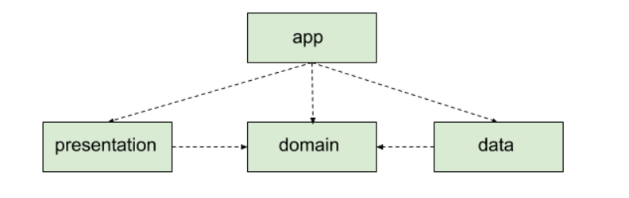

# TestAppPhotoViewer
Test application to show photo gallery

I used clean architecure approach by following in attached picture connections 
and also used multymodule app where DOMAIN layer is just KOTLIN library 
and later can be shared with other platforms like iOS.

